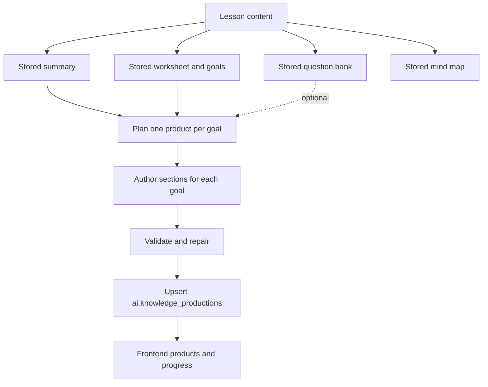

# Knowledge production from existing lessons

`knowledge_production.py` ports the generator from
`Edu-Cognitive-Production-Generatoro/generator/kp` into this project. It creates
only knowledge productions, using records already stored by the template cycle.
The standalone command reads existing materials. The batch cycle and frontend
can generate missing summaries, worksheets, questions and mind maps before
running knowledge production.

## Understand the pipeline

The port retains the reference project's generalized resource format: each
worksheet goal gets its own useful educational product. The model chooses the
resource type, audience, purpose and layout to suit that goal. Products contain
finished explanations, examples, cards, tables or learner activities.

1. `kp/content.py` loads the lesson summary and authoritative worksheet goals.
2. `kp/bank.py` maps optional stored questions to those goals.
3. `kp/production_prompts.py` defines the reference project's authoring rules.
4. `kp/production.py` selects topics in one model call, authors each goal's
   sections, and optionally adapts selected questions from the bank.
5. `kp/production_validate.py` checks goal coverage, language, question references
   and content placement. Invalid results get bounded repair attempts.
6. `kp/store.py` validates the full record against the shipped schema and upserts
   it by lesson UUID. Fingerprints allow unchanged lessons to skip model calls.

Read those files in that order to follow how a stored lesson becomes a product.
The same engine serves the standalone CLI and `kp/integration.py` batch hook.
Both use the project's configured OpenRouter models. Saved products retain
`review.status=pending`, because structural validation cannot establish the
accuracy of every educational explanation.



## Frontend and full cycle

Start the results frontend using the project virtual environment:

```bash
.venv/bin/python results_dashboard.py --port 2007
```

Open `http://localhost:2007`. **نظرة عامة** shows the detached all-lesson
backfill, saved results, active stages, reported tokens and estimated cost.
**مكتبة الدروس** searches by title or exact lesson number, filters complete,
partial and missing knowledge productions, and opens each stored material in
its own tab. **تشغيل جديد** starts a separate run after the active backfill ends.
Select **الإنتاج المعرفي**, enter lesson IDs or a limit, and click **ابدأ التشغيل**.
Selecting knowledge production alone reads existing
summary/worksheet records; leaving IDs empty backfills existing summaries.
Selecting multiple types completes missing lesson materials, then runs knowledge
production. Existing questions do not exclude a lesson from this cycle. When
lesson IDs are supplied, the mixed cycle looks them up directly instead of
scanning all stored lessons; discovery is also shown in the progress log.

The frontend shows a progress bar, completed/successful/skipped/failed lesson
counts, each worker's active stage, goal IDs, validation repair events and live
logs, including completed/total goals within each active lesson. It polls every
two seconds, reports the subprocess exit code and refreshes
stored results after completion. Select a lesson to view all five material types,
including product sections, tables, optional question answers and raw JSON.
Use the preview checkbox for a read-only plan and the regeneration checkbox to
force knowledge production even when its inputs are unchanged.

```bash
# Complete all missing materials, then generate knowledge products.
.venv/bin/python questions_cycle.py --lesson-source-id 445 --workers 2

# Knowledge-only backfill uses the same standalone engine.
.venv/bin/python questions_cycle.py --templates knowledge_productions --limit 10

# Generate missing prerequisites for documents from the Documents API.
.venv/bin/python bulk_generator.py --templates knowledge_productions --max-docs 5 --skip-existing
```

The default full cycle includes knowledge production. `--skip knowledge_productions`
excludes it. `--force-knowledge` forces it in `questions_cycle.py`. When only that
type is selected in the cycle, summary and worksheet records must already exist.
Mixed runs generate missing prerequisites, unless explicitly skipped. Questions
remain optional for knowledge production.

`logs/ui_run.log` contains frontend runs. `ETGS_EVENT` JSON lines describe run,
lesson and stage transitions without including prompts or credentials. CLI
knowledge runs also write their JSON report under `logs/`. Failed or partial
lessons make the command exit nonzero; partial records retain successful products
and list failed goals. Rerunning a current partial lesson retries just those
goals and preserves its successful products; use force to regenerate them all.
Collection provisioning remains an explicit
`--setup-collection` CLI operation.

## Database contract

The default database is **`ai`**. `knowledge_productions` is a **collection** in
that database, alongside the existing template collections:

| Collection | Purpose |
| --- | --- |
| `summaries` | Required lesson text from `summary.opening`, `summary.summary`, `summary.ending` |
| `worksheets` | Required authoritative goals from `worksheet.goals` |
| `questions` | Optional existing questions, answer keys and goal links |
| `knowledge_productions` | Destination: one validated lesson record containing one product per worksheet goal |

Lesson identity (`document_uuid`, `document_idx`, `custom_id`) is preserved.
Saves use an upsert by `document_uuid`, with the original schema version
`3.0.0`, fingerprints, generation metadata, review status and BSON timestamp.
The original renderer can read these records directly. The command produces
stored JSON data; HTML/PDF rendering remains in the original renderer project.

An existing summary and worksheet are required. Missing questions do not block
generation. When questions are used, references and answer keys come from the
stored bank. Mind maps are not an input to the original production pipeline.
Missing content or goals are reported; source records are never written.

For example, inspect one stored lesson in MongoDB Shell:

```javascript
db.getSiblingDB("ai").knowledge_productions.findOne(
  {document_idx: "445"},
  {filename: 1, "products.goal_id": 1, "products.title": 1, failed_goals: 1}
)
```

Each item in `products` represents one goal. Open the full record to inspect
its `sections`, optional `questions`, `registration` metadata and pending
`review` status.

## Setup

Run from this project directory:

```bash
uv pip install --python .venv/bin/python 'jsonschema>=4.21,<5'
```

New installations can install `requirements.txt`. The existing `.env` supplies
`MONGODB_URI`, `OPENROUTER_API_KEY`, `OPENROUTER_BASE_URL`, and
`LLM_MODEL_MATH` / `LLM_MODEL_NORMAL`. Optional `KP_*` settings are listed in
`.env.example`; `KP_MODEL_CREATIVE` and `KP_MODEL_LINK` take precedence over the
shared model settings.

`KP_MAX_TOKENS` defaults to 6,000. If the provider truncates a structured reply,
the runner retries once with a doubled cap, bounded by `KP_MAX_RETRY_TOKENS`
(default 12,000). Set the retry cap equal to the initial cap to disable that
retry. Truncated replies count toward reported model usage. Provider retries and
validation repairs appear in the frontend stage logs.
After a larger cap succeeds, later calls to the same model in that lesson reuse
it within the configured ceiling. Empty unused block fields are normalized to
`null`; substantive misplaced content remains subject to validation and repair.
`KP_LINK_REASONING_EFFORT=low` limits reasoning effort for mechanical question
adaptation; `provider` preserves the model's default. Creative authorship uses
`KP_CREATIVE_REASONING_EFFORT=low` by default so structured replies have room
to finish; set `provider` for that model's original behavior. Invalid provider JSON is
retried once with the same structured schema. This uses OpenRouter's
[reasoning configuration](https://openrouter.ai/docs/guides/best-practices/reasoning-tokens).

The JSON run report includes input, cached input, output and total token counts,
counts by model, and an estimated USD cost. It uses the rates in `.env`:
`LLM_MODEL_MATH_INPUT_1M` / `LLM_MODEL_MATH_OUTPUT_1M` for creative calls and
`LLM_MODEL_NORMAL_INPUT_1M` / `LLM_MODEL_NORMAL_OUTPUT_1M` for question-linking
calls. Cached input uses the same input rate unless `KP_PRICE_CACHED_PER_M` is
set. The report includes all observed model calls, including truncated replies;
provider responses that omit usage cannot contribute token counts. Cost is an
estimate based on reported usage and your entered rates.

By default the command uses the existing destination collection without changing
its validator or indexes. Python validates every record before writing it.
`--setup-collection` explicitly applies the original validator and indexes when
provisioning is needed. Do not use that flag for an already provisioned collection.

## Commands

Preview one lesson without model calls or database writes:

```bash
.venv/bin/python knowledge_production.py --lesson-id 445 --dry-run
```

Generate and save one lesson, or several lessons:

```bash
.venv/bin/python knowledge_production.py --lesson-id 445
.venv/bin/python knowledge_production.py --lesson-id 445 43439 152101
```

`--lesson-source-id` is an alias for `--lesson-id`. IDs refer to the stored
`document_idx`, rather than starting a new Tahdiri questions cycle. UUID and
custom ID lookup are also supported with `--id-type uuid` or `--id-type custom_id`.

Backfill from all existing summaries:

```bash
.venv/bin/python knowledge_production.py --all --dry-run --limit 10
.venv/bin/python knowledge_production.py --all --workers 4
```

Preview generated data locally before saving it:

```bash
.venv/bin/python knowledge_production.py --lesson-id 445 --local-out output/knowledge-preview
```

This uses the configured model but writes the validated record to JSON instead
of MongoDB. Use `--force` if an up-to-date database record already exists.
For an offline model smoke test against database inputs, add `--llm stub`;
placeholder output is only allowed with `--local-out` or `--dry-run`.

Other options:

- `--from-file lesson-ids.txt`: one lesson ID per line.
- `--database ai --collection knowledge_productions`: override storage names.
- `--goals goal_1,goal_2`: regenerate selected goals while keeping others when
  the stored production's fingerprints are current. If it is stale, regenerate
  the whole lesson without `--goals` to preserve a consistent record.
  On a new lesson, unselected goals are marked unfinished so a full run can
  complete them later.
- `--force`: regenerate even when fingerprints and prompt version match.
- `--report logs/my-kp-run.json`: choose the JSON run report path.
- `--journal logs/my-kp-run.jsonl`: write each lesson result and its model usage
  immediately, so long runs retain cost data if interrupted. By default, the
  journal uses the report name with a `.jsonl` extension.

Unchanged productions are skipped. Changed summary content, worksheet goals,
question banks, or prompt versions trigger regeneration. Reports record errors,
failed goals, model usage and status per lesson. A partial run saves successful
products and reports failed goals for retry; exit code `1` means at least one
lesson needs attention. Reports are also written during dry runs; MongoDB remains
read-only in that mode.

If MongoDB stops accepting writes after generation, the validated record is
queued locally under `logs/pending-knowledge-productions/`, reported as
`pending_save`, and the command exits nonzero. Once MongoDB is reachable:

```bash
.venv/bin/python knowledge_production.py --resume-pending logs/pending-knowledge-productions --dry-run
.venv/bin/python knowledge_production.py --resume-pending logs/pending-knowledge-productions
```

Import checks that the current summary, worksheet goals, question bank and
prompt version still match. It refuses to overwrite an existing production.
Successful imports remove their queued files.
The frontend's **حفظ المعلّق** button runs the same import and shows its log
and lesson progress. It shows a database error in the lesson browser while
MongoDB is unavailable, leaving the run log visible.

## Python entry point

The copied `kp` package can also be used independently of the CLI:

```python
from kp.config import Settings
from kp.content import open_content
from kp.llm import OpenRouterLLM
from kp.pipeline import generate_lesson

settings = Settings()
# db is an existing pymongo Database for settings.mongo_db.
result = generate_lesson(
    "445", "idx", content_src=open_content(settings, db), db=db,
    llm=OpenRouterLLM(settings), s=settings,
)
```

To copy this capability to another project, copy `knowledge_production.py` and
the complete `kp/` directory, including `knowledge_production.schema.json`.
Install `openai`, `pydantic`, `pymongo`, `tenacity`, `python-dotenv` and `jsonschema`
using this project's versions. No dependency on the original workspace remains.

Tests use in-memory MongoDB and deterministic models:

```bash
uv pip install --python .venv/bin/python 'pytest>=8,<10' 'mongomock>=4.3,<5'
.venv/bin/python -m pytest tests -q
```
